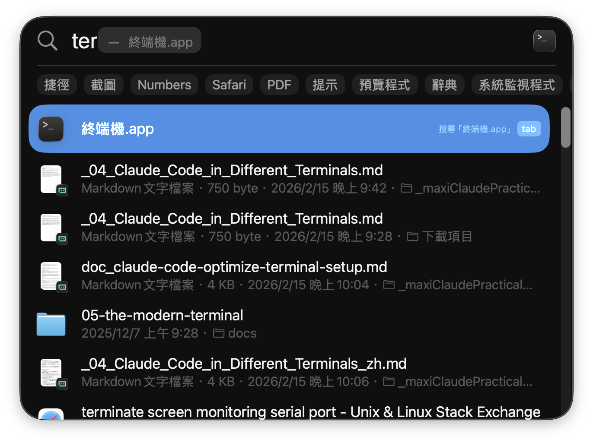
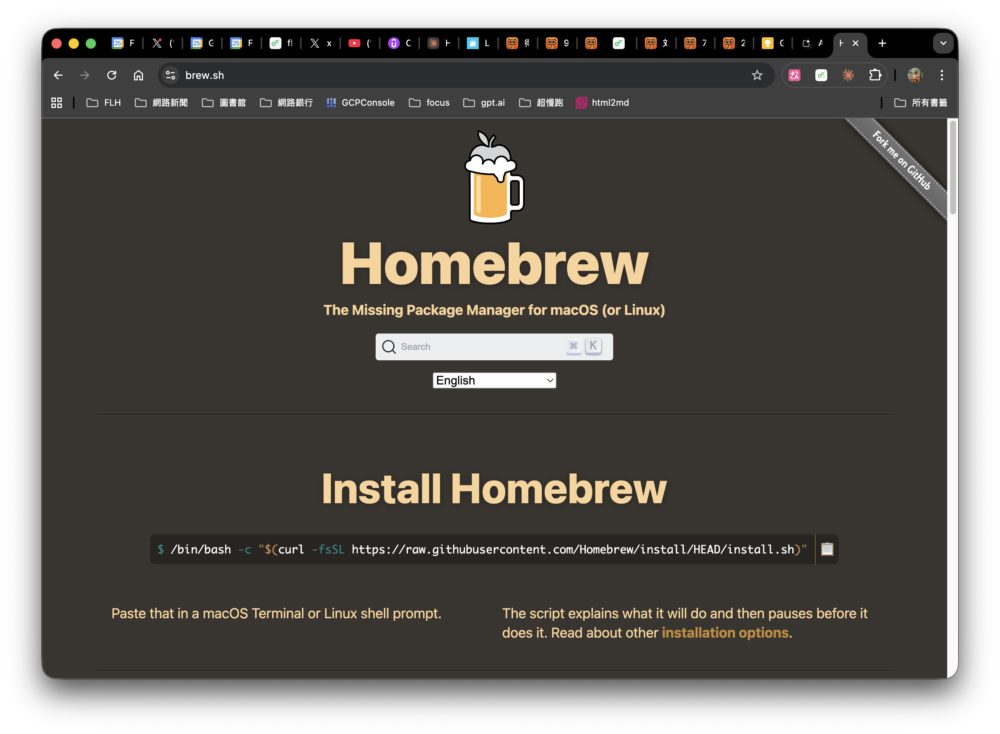
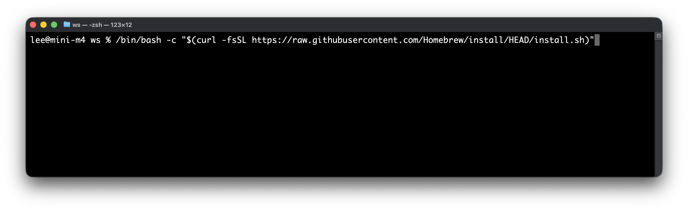
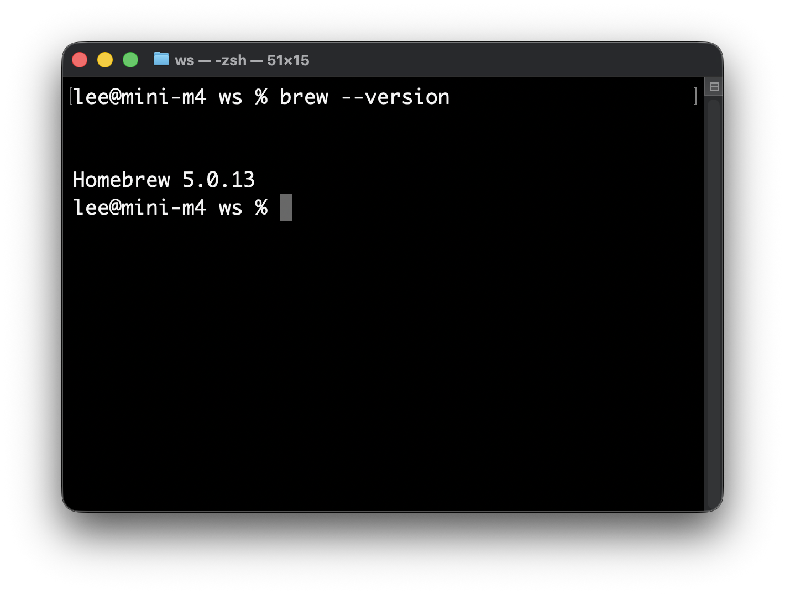
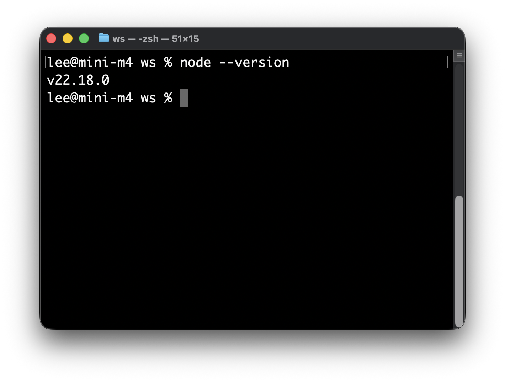
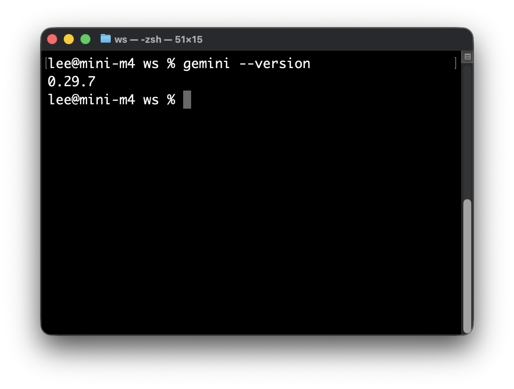
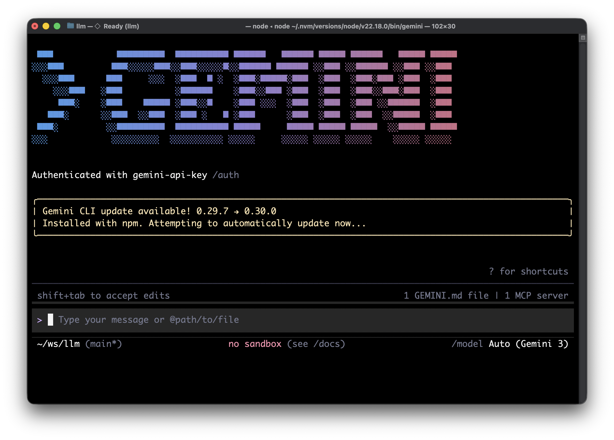

# Gemini CLI 安裝手冊（MacOS）

適用對象：初次安裝的同仁
完成時間：約 15-20 分鐘

---

## 安裝流程總覽

```
步驟 1：安裝 Homebrew（套件管理工具）
步驟 2：安裝 Node.js
步驟 3：安裝 Gemini CLI
步驟 4：取得 API Key
步驟 5：設定 API Key
步驟 6：確認安裝成功
步驟 7：安裝 Agent Skill
```

---

## 開始之前

**需要準備的東西**：
- MacOS 電腦
- 公司指派的 Google AI Studio 帳號（由管理員提供）
- 穩定的網路連線

**Terminal 是什麼？**
Terminal 是 Mac 內建的指令操作工具。找到它的方式：
按下 `Command + 空白鍵` → 輸入「Terminal」→ 按 Enter



本手冊中所有的指令，都需要在 Terminal 中輸入後按 Enter 執行。

---

## 步驟 1：安裝 Homebrew

Homebrew 是 Mac 上最常用的套件管理工具，用來幫你安裝其他軟體。



**確認是否已安裝**：在 Terminal 輸入以下指令

```bash
brew --version
```

- 如果看到類似 `Homebrew 4.x.x` 的文字 → **已安裝，跳到步驟 2**
- 如果看到 `command not found` → 繼續以下步驟

**安裝 Homebrew**：複製以下指令，貼到 Terminal 並按 Enter

```bash
/bin/bash -c "$(curl -fsSL https://raw.githubusercontent.com/Homebrew/install/HEAD/install.sh)"
```



安裝過程中會詢問你的電腦密碼（輸入時畫面不會顯示字元，這是正常的），輸入完按 Enter。

安裝完成後，確認：

```bash
brew --version
```



看到版本號碼即代表成功。

---

## 步驟 2：安裝 Node.js

Gemini CLI 需要 Node.js 才能運行。

**確認是否已安裝**：

```bash
node --version
```

- 如果看到 `v20.x.x` 以上的版本號碼 → **已安裝，跳到步驟 3**
- 如果看到 `command not found` → 繼續以下步驟

**安裝 Node.js**：

```bash
brew install node
```

安裝過程需要 1-3 分鐘，等待出現新的輸入提示符號（`$` 或 `%`）即代表完成。

**確認安裝成功**：

```bash
node --version
```



看到 `v20.x.x` 以上的版本號即代表成功。

---

## 步驟 3：安裝 Gemini CLI

**執行安裝指令**：

```bash
npm install -g @google/gemini-cli
```

安裝過程需要 1-2 分鐘。

**確認安裝成功**：

```bash
gemini --version
```


看到版本號碼即代表成功。

---

## 步驟 4：取得 API Key

> 此步驟需要使用公司指派的 Google 帳號。如尚未取得帳號，請聯繫管理員。

1. 開啟瀏覽器，前往：**https://aistudio.google.com/apikey**
2. 使用公司帳號登入
3. 點擊「建立 API 金鑰」
4. 複製產生的 API Key（格式類似：`AIzaSyXXXXXXXXXXXXXXXXXX`）

**重要**：API Key 請妥善保管，不要分享給他人或貼到公開場合。

---

## 步驟 5：設定 API Key

將 API Key 設定到你的電腦環境中，讓 Gemini CLI 每次啟動時都能自動取用。

**開啟設定檔**：

```bash
open ~/.zshrc
```

如果出現錯誤，改用：

```bash
touch ~/.zshrc && open ~/.zshrc
```

文字編輯器會開啟一個檔案。在檔案**最末尾**加上以下這一行（將 `YOUR_API_KEY` 替換為你剛才複製的 API Key）：

```
export GEMINI_API_KEY="YOUR_API_KEY"
```

儲存後關閉編輯器。

**讓設定生效**：

```bash
source ~/.zshrc
```

**確認設定成功**：

```bash
echo $GEMINI_API_KEY
```

如果看到你的 API Key內容（不是空白），代表設定成功。

---

## 步驟 6：確認安裝成功，進行第一次對話

**啟動 Gemini CLI**：

```bash
gemini
```


看到提示符號（`>`）後，輸入一句話測試：

```
你好，請用繁體中文自我介紹
```

如果 Gemini 正常回覆，代表安裝完成。

**離開 Gemini CLI**：輸入 `/exit` 或按 `Ctrl + C`

---

## 步驟 7：安裝 Agent Skill

Skill 是讓 Gemini CLI 學會特定工作流程的擴充功能。安裝後，只需說出關鍵詞，Gemini 就能自動執行對應的工作流程。

**建立 Skills 目錄**：

```bash
mkdir -p ~/.gemini/skills
```

**安裝 Skill**（由管理員提供 Skill 壓縮檔或目錄）：

將 Skill 資料夾複製到 `~/.gemini/skills/` 目錄下。

例如，安裝 `daily-log-coach` Skill：

```bash
cp -r /path/to/daily-log-coach ~/.gemini/skills/
```

> 管理員會提供正確的 Skill 來源路徑，替換上方指令中的 `/path/to/daily-log-coach`。

**確認 Skill 已載入**：

重新啟動 Gemini CLI：

```bash
gemini
```

輸入以下指令查看已安裝的 Skills：

```
/skills list
```

看到 `daily-log-coach` 出現在列表中，即代表安裝成功。

**測試 Skill**：

```
我今天完成了第一次 Gemini CLI 安裝
```

如果 Gemini 自動觸發日誌記錄功能，代表 Skill 運作正常。

---

## 常見問題

**Q：步驟 3 安裝時出現 `permission denied` 錯誤**

請勿使用 `sudo npm install -g ...`。建議先確認你是使用 Homebrew 安裝的 Node.js，然後重開 Terminal 再執行：

```bash
brew reinstall node
npm install -g @google/gemini-cli
```

---

**Q：`gemini` 指令找不到（`command not found`）**

重新啟動 Terminal 後再試一次。如果仍然失敗，執行：

```bash
export PATH="$(npm config get prefix)/bin:$PATH"
```

---

**Q：API Key 設定後仍顯示未授權**

確認 `.zshrc` 檔案中的 Key 沒有多餘的空格，且引號完整。可以用以下指令確認：

```bash
grep GEMINI_API_KEY ~/.zshrc
```

---

**Q：不確定目前安裝了哪些 Skills**

在 Gemini CLI 中輸入：

```
/skills list
```

---

## 安裝完成確認清單

完成所有步驟後，請確認以下項目：

- [ ] `brew --version` 有顯示版本號
- [ ] `node --version` 顯示 v20 以上
- [ ] `gemini --version` 有顯示版本號
- [ ] `echo $GEMINI_API_KEY` 有顯示 API Key
- [ ] 啟動 `gemini` 後能正常對話
- [ ] `/skills list` 能看到已安裝的 Skill

全部打勾，安裝完成。如有任何步驟卡關，請聯繫管理員。

---

文件版本：v1.0（2026-02-25）
